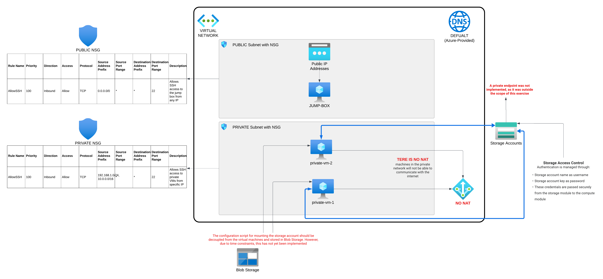

# Secure Azure Infrastructure with Terraform

## Overview

This repository contains a Terraform project that provisions a secure, production-ready Azure infrastructure.
It demonstrates best practices for Infrastructure as Code (IaC), modular design, and secure access patterns.

**Features:**

- 2 private Azure VMs (Ubuntu 22.04 LTS, Standard_B1s)
- Virtual Network with public and private subnets
- Jump box (bastion host) for secure SSH access
- Network Security Groups restricting SSH to allowed IPs
- Azure Storage Account with lifecycle management
- Azure File Share mounted to VMs via SMB

**Diagram**

**Limitations**

- User Management: Due to time limitations and the fact that user management was optional, the mentioned module has not been delivered.
- SSH Keys: We are using two SSH keys—one for the bastion host and one for the VM host. Due to time constraints, SSH key management has not been included.
- In this example, we are using the same SSH key for both the jump host and the virtual machine

Edit locals.tf to set locals for your SSH keys

<pre>
locals {
  admin_ssh_key        = file("./ssh/id_rsa.pub")
  jump_box_admin_ssh_key = file("./ssh/id_rsa.pub")
}
</pre>

---

## Requirements

- [Terraform](https://www.terraform.io/downloads.html) >= 1.3.0
- Azure CLI authenticated (`az login`)
- An Azure subscription (free tier is sufficient)
- SSH key pairs for admin and jump box users

---

## Prroject Structure

<pre>
├── main.tf
├── variables.tf
├── outputs.tf
├── providers.tf
├── terraform.tfvars
├── locals.tf
├── ssh/
├── docs/
├── modules/
│   ├── networking/
│   ├── compute/
│   ├── jump_box/
│   └── storage/
└── README.md
</pre>

| Path / File                | Description                                                                                   |
|----------------------------|----------------------------------------------------------------------------------------------|
| `main.tf`                  | Root Terraform configuration. Instantiates all modules and wires up variables/outputs.        |
| `variables.tf`             | Declares all input variables used throughout the project.                                    |
| `outputs.tf`               | Defines outputs such as storage account name, VM IPs, and jump box public IP.                |
| `providers.tf`             | Specifies required Terraform providers and their versions.                                   |
| `terraform.tfvarss`         | Example variable values                                                                     |
| `locals.tf`                | Define local values                                                                          |
| `docs/`                    | Project documentation                                                                        |
| `ssh/`                     | Your ssh keys                                                                                |
| `modules/`                 | Contains reusable, logically separated Terraform modules.                                    |
| `modules/networking/`      | Provisions the virtual network, public and private subnets.                                  |
| `modules/compute/`         | Deploys private VMs, configures NSGs, and mounts Azure File Share.                           |
| `modules/jump_box/`        | Deploys the jump box VM, its NSG, public IP, and network interface.                          |
| `modules/storage/`         | Creates the storage account, file share, and lifecycle management policies.                  |
| `README.md`                | Project documentation and usage instructions.                                                |

---
##  Configure Variables

Edit terraform.tfvars to set values for your environment.
    Example:

    location            = "UK South"
    project_name        = "MyProject"
    resource_group_name = "MyResourceGroup"

    admin_username      = "adminUser"
    allowed_ssh_ips     = ["<your-ip>/32"]

    jump_box_admin_username  = "jumpadmin"
    jump_box_allowed_ssh_ips = ["<your-ip>/32"]

## Architecture

<pre>
[Your IP]
   |
   | SSH (allowed IPs only)
   v
[Jump Box VM] (Public Subnet, Public IP)
   |
   | SSH (internal only)
   v
[Private VMs] (Private Subnet, No Public IP)
   |
   | SMB (Azure File Share mounted)
   v
[Azure Storage Account]

</pre>

- **Jump Box**: Only public entry point, restrictable by IP.
- **Private VMs**: No public IPs, accessible only via jump box.
- **Storage**: File share mounted to VMs, lifecycle policies for cost control.

---

## Usage

### 1. Clone the Repository
git clone https://github.com/donfirst/hn.git

cd hn

### 2. Login to Azure
Authenticate with Azure using the Azure CLI:

az login

This should be sufficient to authenticate you with Microsoft Entra ID (formerly Azure AD).
If you encounter issues, you can try:

az account get-access-token

### 3.Generate SSH Keys
Navigate to the ssh directory in the root of the repository:

cd ssh

ssh-keygen -m PEM -t rsa -b 4096 -C "azureuser@myserver"

When prompted for the file in which to save the key, enter ./id_rsa.

This will save your private key as id_rsa and your public key as id_rsa.pub in the ssh directory.

Set the correct permissions (Linux/macOS):

chmod 600 ./id_rsa        # Only you can read or modify your private key

chmod 644 ./id_rsa.pub    # Public key is readable by others

Note: SSH key management is outside the scope of this exercise.

If you want to use a different location for your keys, update the path in locals.tf

### 4. Initialize Terraform
Navigate to the root directory of the repository:

cd ..

terraform init

### 5. Plan the Deployment
terraform plan
### 6. Apply the Deployment
terraform apply

---

## Outputs

After deployment, Terraform will output:
- ***admin_username***
- ***jump_box_admin_username***
- File Share Name: The name assigned to the file share within the storage account.
- Jump Box NIC ID: The Network Interface Card (NIC) ID associated with the jump box VM.
- **Jump Box Public IP:** The public IP address assigned to the jump box for external access.
- Private Subnet ID: The unique identifier for the private subnet within the virtual network.
- Private Subnet Name: The name assigned to the private subnet where private VMs are located.
- **Private VM Private IPs:** The private IP addresses assigned to the private VMs in the private subnet.
- Public Subnet Name: The name assigned to the public subnet that allows external connectivity.
- Storage Account Key: The access key used to authenticate to the Azure storage account.
- Storage Account Name: The name of the Azure storage account where resources are stored.
- VNet Name: The name of the virtual network encompassing the public and private subnets

---

## Accessing the Infrastructure

1. **SSH to Jump Box:**

- Edit the SSH Config File: Open or create the SSH config file:
<pre>
vi ~/.ssh/config
</pre>

- Add the Configuration: Add the following entries to define the bastion host and target VM:

<pre>
Host bastion
    HostName BASTION_PUBLIC_IP
    User jumpadmin
    IdentityFile <path to your repo/ssh/id_rsa >

Host target-vm
    HostName TARGET_VM_PRIVATE_IP
    User adminUser
    IdentityFile <path to your repo/ssh/id_rsa >
    ProxyJump bastion
</pre>

- Connect to the Target VM: After saving the config file, you can connect to the target VM with a simple command:

**ssh target-vm**

Explanation:
- Host bastion: Defines the bastion host.
- HostName BASTION_PUBLIC_IP: The public IP of the bastion host.
- User jumpadmin: The username for the bastion host.
- IdentityFile **example** "~/.ssh/id_rsa_bastion": The private key for the bastion host.
- Host target-vm: Defines the target VM.
- HostName TARGET_VM_PRIVATE_IP: The private IP of the target VM.
- User adminUser: The username for the target VM.
- IdentityFile **example** "~/.ssh/id_rsa_vm": The private key for the target VM.
- ProxyJump bastion: Specifies that the bastion host should be used as a jump host.

3. **Azure File Share:**

   - Mounted at `/mnt/azfileshare` on each VM.

---

## Security Notes

- SSH access is restricted by IP via NSGs.
- No public IPs on private VMs.
- Storage account enforces HTTPS.
- Lifecycle policies reduce storage costs and exposure.

---

## Clean Up

To destroy all resources:

terraform destroy
